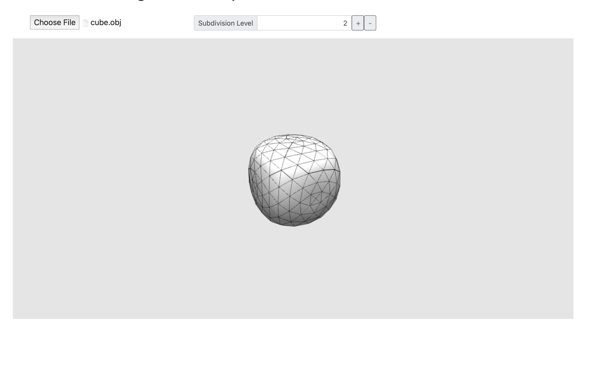

# Loop-Subdivision-for-Meshes
Implemented a topological subdivision approach to smooth the mesh by increasing the subdivision level. The algorithm first divide each triangle in the mesh into four new triangles. Then it uses new vertices to replace the old ones.

